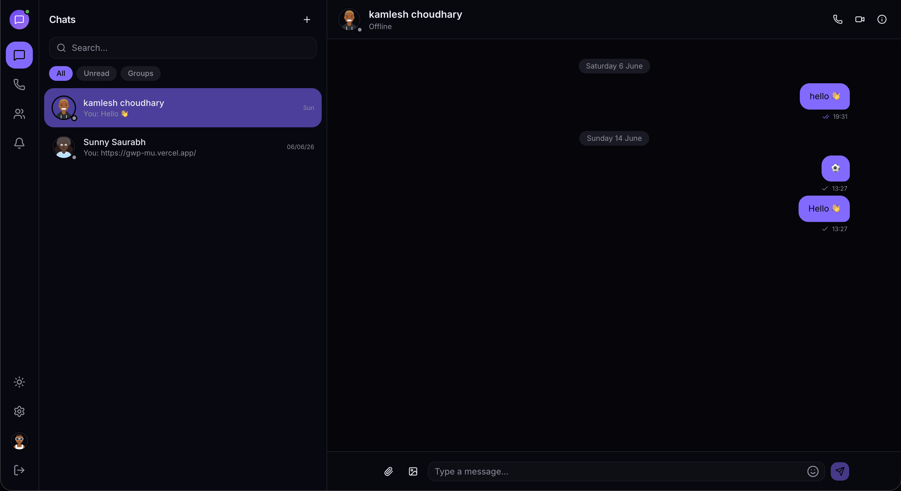
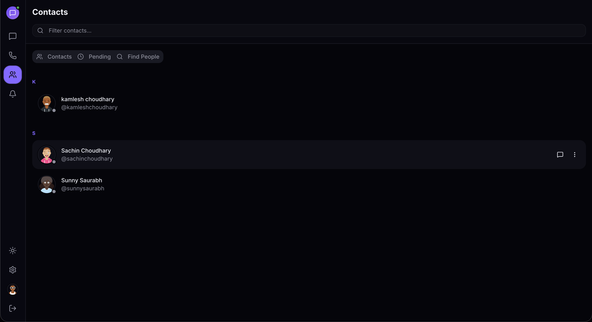
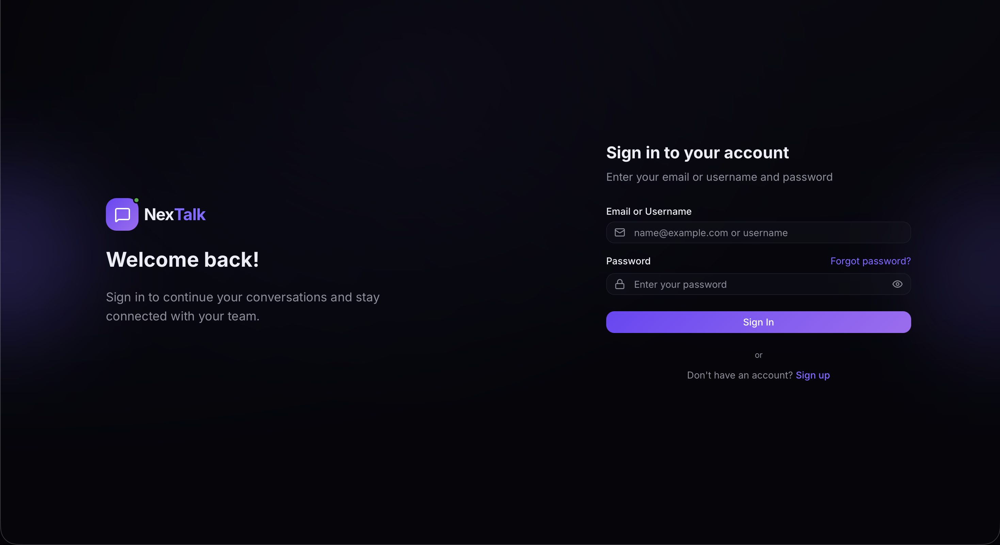

# NexTalk — Real-Time Chat & Calling Platform


**NexTalk** is a full-stack, real-time **messaging and calling platform** — a modern WhatsApp-style experience built for the web. It pairs a **Next.js 16 / React 19** client with an **Express 5** API and a **Socket.IO** real-time layer, delivering instant one-to-one and group chat, WebRTC audio/video calls, presence, typing indicators, read receipts, and push-style notifications.

The backend follows a clean, **feature-modular architecture** (API modules, repositories, services, socket handlers, and pluggable adapters for email/upload), while the frontend uses a **feature-sliced** structure with Redux Toolkit and shadcn/ui.

---

## Table of Contents

- [Features](#features)
- [Tech Stack](#tech-stack)
- [Architecture](#architecture)
- [Screenshots](#screenshots)
- [Prerequisites](#prerequisites)
- [Getting Started](#getting-started)
  - [1. Clone the Repository](#1-clone-the-repository)
  - [2. Install Dependencies](#2-install-dependencies)
  - [3. Configure Environment Variables](#3-configure-environment-variables)
  - [4. Run the Application](#4-run-the-application)
- [Project Structure](#project-structure)
- [API Reference](#api-reference)
- [Real-Time Events](#real-time-events)
- [Contributing](#contributing)
- [License](#license)

---

## Features

### Messaging
- Real-time **one-to-one** and **group** conversations over Socket.IO
- **Typing indicators**, **delivery** and **read receipts**
- **Media messages** — image / file uploads via Cloudinary (or local/Supabase adapters)
- **Edit** and **delete** messages, with broadcast sync across devices
- **Emoji reactions** on messages
- **Pin**, **mute**, and **leave** conversations
- Cursor-based message pagination for smooth infinite scroll

### Calls (WebRTC)
- **Audio** and **video** calls, peer-to-peer via WebRTC
- Server acts as a pure **signaling relay** — media never touches the server
- Incoming-call modal with **accept / reject / hang-up** flow
- Persistent **call history** with missed-call badge

### Presence & Notifications
- Live **online / offline** presence with status changes
- Cross-device **unread badges** and read-all sync
- Real-time **notification feed** with cursor pagination

### Contacts
- Send, accept, and reject **contact requests**
- **Block / unblock** users
- Relationship status and paginated contact lists
- User search and public profiles by username

### Authentication & Security
- **Email + OTP** signup verification
- **JWT** authentication via secure HTTP-only cookies
- **Forgot / reset password** via emailed token
- **Rate limiting**, **Helmet** hardening, **CORS**, and request-ID tracing
- Password hashing with **bcrypt**

### Profile & Settings
- Editable display name, bio, social links, and profile visibility
- **Username** changes with a cooldown window
- **Avatar** upload / replace
- Notification and privacy settings

---

## Tech Stack

### Frontend
| Technology | Version | Purpose |
|---|---|---|
| Next.js | 16.2.6 | React framework (App Router) |
| React | 19.2.4 | UI library |
| Redux Toolkit | 2.12.0 | Global state management |
| React Redux | 9.3.0 | React bindings for Redux |
| Tailwind CSS | 4.x | Utility-first styling |
| shadcn/ui + Radix UI | — | Accessible component primitives |
| Socket.IO Client | 4.8.3 | Real-time transport |
| Lucide / React Icons | — | Icon sets |
| next-themes | 0.4.6 | Light / dark theming |
| Sonner | 2.0.7 | Toast notifications |

### Backend
| Technology | Version | Purpose |
|---|---|---|
| Node.js | 18+ | JavaScript runtime |
| Express | 5.2.1 | Web framework |
| MongoDB + Mongoose | — / 9.1.2 | Database & ODM |
| Socket.IO | 4.8.3 | Real-time WebSocket layer |
| JSON Web Token | 9.0.3 | Authentication tokens |
| Bcrypt | 6.0.0 | Password hashing |
| Cloudinary | 2.8.0 | Media cloud storage |
| Supabase JS | 2.106.2 | Alternative storage adapter |
| Nodemailer | 8.0.8 | Email transport |
| OTP Generator | 4.0.1 | One-time password generation |
| Helmet | 8.2.0 | HTTP security headers |
| Compression | 1.8.1 | Response compression |
| Express File Upload | 1.5.2 | Multipart file handling |
| Cookie Parser | 1.4.7 | Cookie handling |
| CORS | 2.8.5 | Cross-origin resource sharing |
| Dotenv | 17.2.3 | Environment variable management |

---

## Architecture

NexTalk is split into two independently deployable applications.

The **backend** uses a layered, feature-modular design. Each domain (`auth`, `user`, `chat`, `message`, `notification`, `call`) lives in its own folder under `src/api/` with routes, controllers, services, DTOs, and validation. Data access is isolated behind a **repository** layer (`src/database/repositories/`), and cross-cutting concerns — email and file upload — are implemented as **pluggable adapters** (`brevo` / `console` for email; `cloudinary` / `local` / `supabase` for uploads), selectable by environment variable. Real-time logic lives in `src/sockets/`, with dedicated handlers per domain and a swappable `memory` / `redis` adapter for horizontal scaling.

The **frontend** uses a **feature-sliced** structure under `src/features/` (e.g. `auth`, `chat`, `call`, `notification`, `presence`, `socket`), each bundling its own components, hooks, services, and Redux slice. The App Router groups routes into `(auth)` and `(main)` segments, and a central `SocketProvider` shares a single Socket.IO connection across features.

---

## Screenshots

### Chat


### Audio Call


### Contacts


### Authentication (Login / Signup / OTP)


---

## Prerequisites

Make sure the following are installed and available before proceeding:

- [Node.js](https://nodejs.org/) (v18 or later recommended)
- [npm](https://www.npmjs.com/) (v9 or later)
- [MongoDB](https://www.mongodb.com/) — a local instance **or** a [MongoDB Atlas](https://www.mongodb.com/cloud/atlas) cluster
- [Cloudinary](https://cloudinary.com/) account — optional, required for media uploads
- [Brevo](https://www.brevo.com/) account — optional, for production transactional emails (in development, emails print to the console)

---

## Getting Started

### 1. Clone the Repository

```bash
git clone https://github.com/<your-username>/NexTalk.git
cd NexTalk
```

### 2. Install Dependencies

Install the backend and frontend packages separately:

```bash
# Backend dependencies
cd backend
npm install
cd ..

# Frontend dependencies
cd frontend
npm install
cd ..
```

### 3. Configure Environment Variables

#### Backend

Create a `.env` file inside the **`backend/`** directory (an `.env.example` is provided as a template):

```env
# ── Server ────────────────────────────────────────────────
NODE_ENV=development
PORT=4000
FRONTEND_URL=http://localhost:3000

# ── Database ──────────────────────────────────────────────
DATABASE_URL=mongodb://localhost:27017/NexTalk

# ── JWT ───────────────────────────────────────────────────
# Generate strong secrets:
# node -e "console.log(require('crypto').randomBytes(64).toString('hex'))"
JWT_ACCESS_SECRET=your_access_token_secret_here
JWT_REFRESH_SECRET=your_refresh_token_secret_here
JWT_ACCESS_EXPIRES_IN=15m
JWT_REFRESH_EXPIRES_IN=7d

# ── Cloudinary (optional — uploads fail without it) ───────
CLOUDINARY_CLOUD_NAME=your_cloud_name
CLOUDINARY_API_KEY=your_api_key
CLOUDINARY_API_SECRET=your_api_secret
FOLDER_NAME=NexTalk

# ── Email ─────────────────────────────────────────────────
# 'console' prints emails to the terminal (dev); 'brevo' sends real emails (prod)
EMAIL_PROVIDER=console
BREVO_API_KEY=your_brevo_api_key_here
EMAIL_FROM_NAME=NexTalk
EMAIL_FROM_ADDRESS=noreply@yourdomain.com
```

> **Required variables:** `DATABASE_URL`, `JWT_ACCESS_SECRET`, and `FRONTEND_URL` are validated at startup — the server will refuse to boot without them.

#### Frontend

Create a `.env.local` file inside the **`frontend/`** directory:

```env
NEXT_PUBLIC_API_URL=http://localhost:4000
```

### 4. Run the Application

Open two terminals.

```bash
# Terminal 1 — Backend (http://localhost:4000, API at /api/v1)
cd backend
npm run dev

# Terminal 2 — Frontend (http://localhost:3000)
cd frontend
npm run dev
```

To seed the database with sample data:

```bash
cd backend
npm run seed
```

Available backend scripts: `npm run dev` (nodemon), `npm start` (production), `npm run seed`.
Available frontend scripts: `npm run dev`, `npm run build`, `npm start`, `npm run lint`.

---

## Project Structure

```
NexTalk/
├── README.md
├── backend/                          # Express 5 + Socket.IO API
│   ├── .env.example                  # Environment variable template
│   ├── package.json
│   └── src/
│       ├── server.js                 # HTTP + Socket.IO bootstrap
│       ├── app.js                    # Express app, middleware, routes
│       ├── api/                       # Feature modules (routes/controller/service/dto)
│       │   ├── index.js              # Mounts all routers under /api/v1
│       │   ├── auth/                 # Signup, login, OTP, password reset
│       │   ├── user/                 # Profile, settings, search + contacts sub-router
│       │   ├── chat/                 # Direct & group conversations
│       │   ├── message/              # Messages, media, reactions
│       │   ├── notification/         # Notification feed
│       │   └── call/                 # Call history
│       ├── config/                    # App, database, JWT, email, cloudinary config
│       ├── core/                      # Cross-cutting framework code
│       │   ├── base/                 # Base repository
│       │   ├── errors/               # AppError + error codes
│       │   ├── middleware/           # auth, error, rate-limit, validate, logging
│       │   └── response/             # Standardized ApiResponse
│       ├── database/
│       │   ├── models/               # Mongoose schemas (User, Chat, Message, …)
│       │   └── repositories/         # Data-access layer
│       ├── shared/
│       │   ├── constants/            # events, roles, status
│       │   ├── email/                # Email service + adapters + templates
│       │   ├── upload/               # Upload manager + cloudinary/local/supabase adapters
│       │   ├── helpers/              # otp, token, file helpers
│       │   └── utils/                # logger, pagination, async-handler
│       ├── sockets/                   # Real-time layer
│       │   ├── socket.manager.js     # Socket.IO server setup
│       │   ├── socket.auth.js        # Socket authentication
│       │   ├── handlers/             # chat, call, presence, notification handlers
│       │   └── adapters/             # memory / redis scaling adapters
│       └── scripts/
│           └── seed.js               # Database seeder
└── frontend/                          # Next.js 16 (App Router) client
    ├── package.json
    └── src/
        ├── app/                       # App Router routes
        │   ├── (auth)/               # login, signup, verify-otp, reset-password
        │   └── (main)/               # chat, calls, contacts, notifications, profile, settings
        ├── components/                # Shared UI
        │   ├── common/               # logo, avatar, empty-state, oauth-buttons
        │   ├── layout/               # sidebar, mobile-nav
        │   └── ui/                   # shadcn/ui primitives
        ├── features/                  # Feature-sliced modules
        │   ├── auth/                 # guards, hooks, slice, authApi
        │   ├── chat/                 # chat window, sidebar, message bubbles, slice
        │   ├── call/                 # call screen, WebRTC hooks, slice
        │   ├── notification/         # notification slice + socket hook
        │   ├── presence/             # presence slice + hook
        │   ├── profile/              # avatar upload
        │   └── socket/               # SocketProvider, context, services
        ├── services/                  # baseApi + shared API utilities
        ├── store/                     # Redux store configuration
        ├── providers/                 # App + theme providers
        ├── hooks/                     # use-mobile, use-toast
        ├── lib/                       # utils
        └── constants/                 # app constants
```

---

## API Reference

All API routes are prefixed with `/api/v1`. Protected routes require a valid JWT, sent automatically via an HTTP-only cookie.

### Authentication — `/api/v1/auth`

| Method | Endpoint | Description | Auth |
|---|---|---|---|
| POST | `/signup` | Register a new user | Public |
| POST | `/login` | Login and receive JWT cookie | Public |
| POST | `/verify-email` | Verify email with OTP | Public |
| POST | `/resend-verification` | Resend verification OTP | Public |
| POST | `/forgot-password` | Request a password-reset email | Public |
| POST | `/reset-password` | Reset password using token | Public |
| POST | `/logout` | Clear the auth session | Required |
| GET | `/me` | Get the authenticated user | Required |

### Users — `/api/v1/users`

| Method | Endpoint | Description | Auth |
|---|---|---|---|
| GET | `/me` | Own full profile | Required |
| PATCH | `/me` | Update profile (name, bio, visibility, links) | Required |
| PATCH | `/me/username` | Update username (cooldown applies) | Required |
| PATCH | `/me/settings` | Update notification & privacy settings | Required |
| PATCH | `/me/avatar` | Upload / replace avatar | Required |
| GET | `/search?q=&page=&limit=` | Paginated user search | Required |
| GET | `/check-username` | Check username availability | Required |
| GET | `/by-username/:username` | Public profile by username | Required |
| GET | `/:userId/status` | Online / offline status | Required |
| GET | `/:id` | Public profile by id | Required |

### Contacts — `/api/v1/users/contacts`

| Method | Endpoint | Description | Auth |
|---|---|---|---|
| GET | `/` | List accepted contacts (paginated) | Required |
| GET | `/pending` | Inbox + outbox pending requests | Required |
| GET | `/relationship/:userId` | Relationship status with a user | Required |
| POST | `/request` | Send a contact request | Required |
| POST | `/accept` | Accept an incoming request | Required |
| POST | `/reject` | Reject an incoming request | Required |
| DELETE | `/:userId` | Remove an accepted contact | Required |
| POST | `/block` | Block a user | Required |
| DELETE | `/block/:userId` | Unblock a user | Required |

### Chats — `/api/v1/chats`

| Method | Endpoint | Description | Auth |
|---|---|---|---|
| GET | `/` | List my chats | Required |
| POST | `/direct` | Get or create a direct chat | Required |
| POST | `/group` | Create a group chat | Required |
| GET | `/:id` | Get a chat by id | Required |
| PATCH | `/:id/read` | Mark chat as read | Required |
| PATCH | `/:id/pin` | Toggle pin | Required |
| PATCH | `/:id/mute` | Toggle mute | Required |
| DELETE | `/:id/leave` | Leave a group chat | Required |
| DELETE | `/:id` | Delete a chat | Required |

### Messages — `/api/v1/chats/:chatId/messages`

| Method | Endpoint | Description | Auth |
|---|---|---|---|
| GET | `/` | Get messages (cursor paginated) | Required |
| POST | `/` | Send a text message | Required |
| POST | `/media` | Send a media message | Required |
| PATCH | `/:messageId` | Edit a message | Required |
| DELETE | `/:messageId` | Delete a message | Required |
| POST | `/:messageId/reactions` | Add a reaction | Required |
| DELETE | `/:messageId/reactions` | Remove a reaction | Required |

### Notifications — `/api/v1/notifications`

| Method | Endpoint | Description | Auth |
|---|---|---|---|
| GET | `/?limit=&before=` | List notifications (cursor paginated) | Required |
| GET | `/unread-count` | Unread count for the badge | Required |
| PATCH | `/read-all` | Mark all as read | Required |
| PATCH | `/:id/read` | Mark one as read | Required |
| DELETE | `/:id` | Delete a notification | Required |

### Calls — `/api/v1/calls`

| Method | Endpoint | Description | Auth |
|---|---|---|---|
| GET | `/?limit=&before=` | Call history (cursor paginated) | Required |
| GET | `/missed-count` | Missed-call count for the badge | Required |
| DELETE | `/` | Clear entire call history | Required |
| DELETE | `/:id` | Delete a single call entry | Required |

---

## Real-Time Events

NexTalk communicates over Socket.IO using a `<domain>:<action>` naming convention. The canonical list lives in `backend/src/shared/constants/events.js` and is mirrored on the client.

### Chat
`chat:join_room`, `chat:leave_room`, `chat:new_message`, `chat:message_sent`, `chat:message_delivered`, `chat:message_read`, `chat:typing_start`, `chat:typing_stop`, `chat:message_deleted`, `chat:message_edited`, `chat:reaction_added`, `chat:unread_updated`, `chat:chat_updated`, `chat:new_chat`

### Calls (WebRTC signaling)
Client → Server: `call:initiate`, `call:accept`, `call:reject`, `call:end`, `call:offer`, `call:answer`, `call:ice_candidate`
Server → Client: `call:incoming`, `call:accepted`, `call:rejected`, `call:ended`, `call:logged`

The server only **relays** signaling messages — audio and video stream peer-to-peer between clients.

### Presence
`presence:user_online`, `presence:user_offline`, `presence:status_change`, `presence:bulk_status`

### Notifications
`notification:new`, `notification:read`, `notification:read_all`

---

## Contributing

Contributions are welcome! Follow these steps:

1. **Fork** the repository
2. **Create** a feature branch: `git checkout -b feature/your-feature-name`
3. **Commit** your changes: `git commit -m "feat: add your feature"`
4. **Push** to your branch: `git push origin feature/your-feature-name`
5. **Open a Pull Request** targeting the `main` branch

Please follow the existing code style and write clear commit messages.

---

## License

This project is open-source and available under the [MIT License](LICENSE).

---

<p align="center">Built with ❤️ using Next.js, Express, and Socket.IO</p>
